## Giới thiệu:
- Môn học: Lập trình WWW (Java)
- Chủ đề: Bài tập tuần 07
   

## Đề bài:
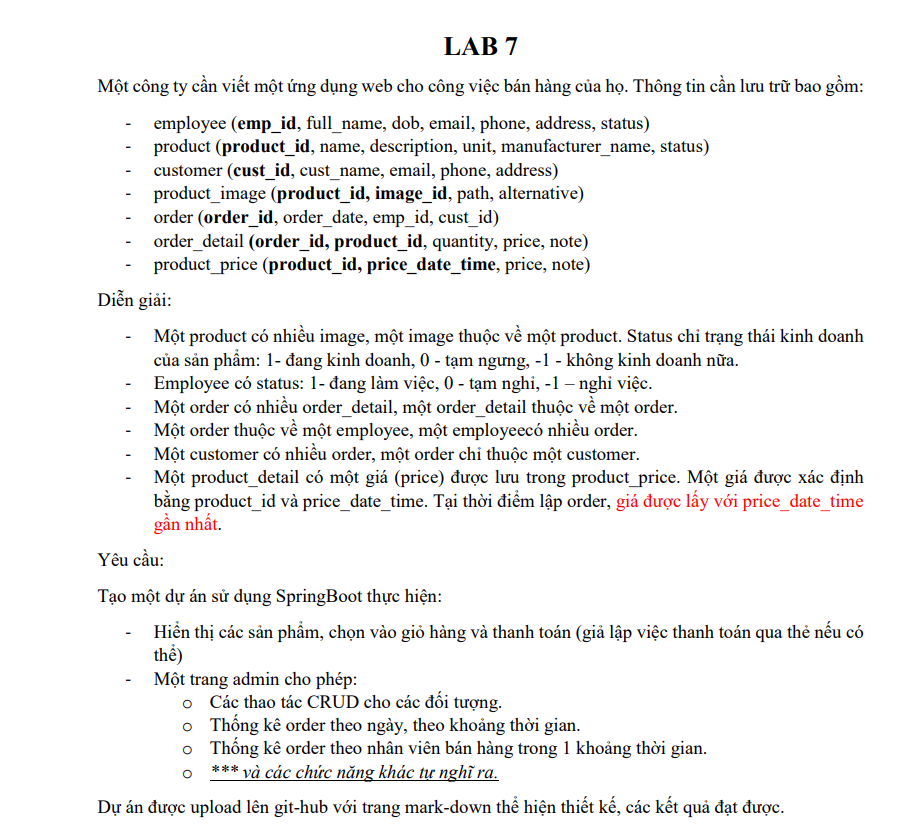
 

## Bài làm:
<b>1.Bán hàng</b>
- Đăng nhập
  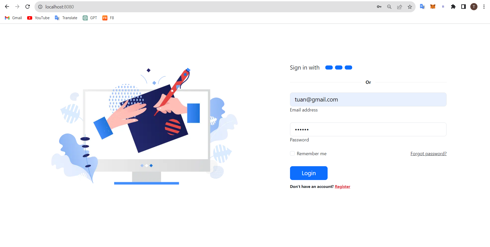
- Hiển thị sản phẩm theo giá mới nhất
  
- Nhấn thêm sản phẩm vào giỏ hàng xong bấm vào giỏ hàng sẽ hiển thị những sản phẩm đã thêm vào giỏ hàng được lưu trong session
  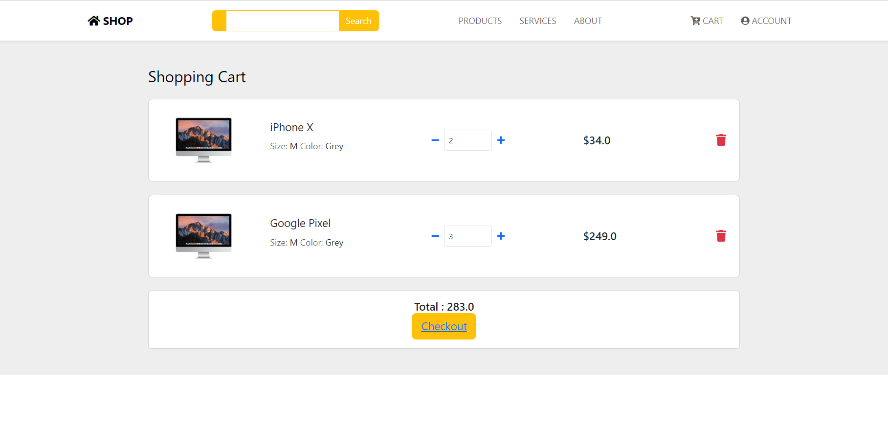
- Bấm checkout để chuyển tới giao diện thanh toán bằng thẻ
  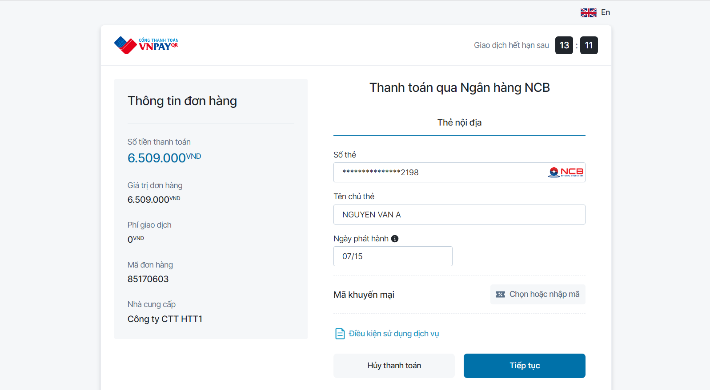
- Nhập thông tin thẻ và tiếp tục sau đó xác thực OTP
    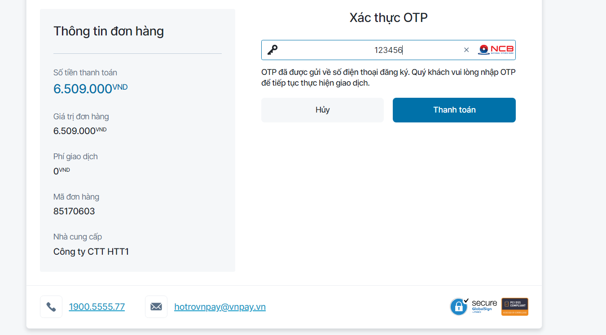
- Thanh toán thành công sẽ có lịch sử giao dịch và chuyển về trang chủ
  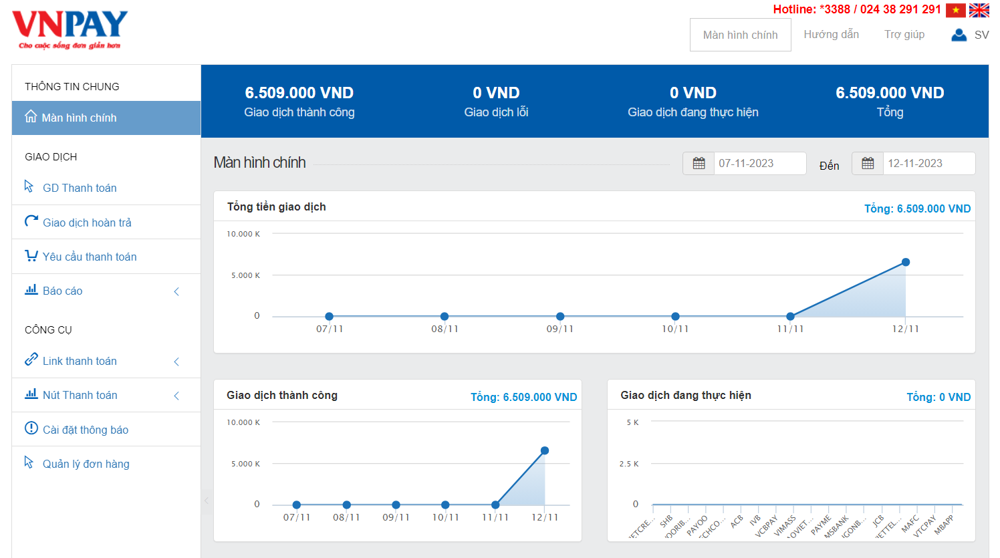
  <b>2.Quản lý</b>
- Report theo tuần
  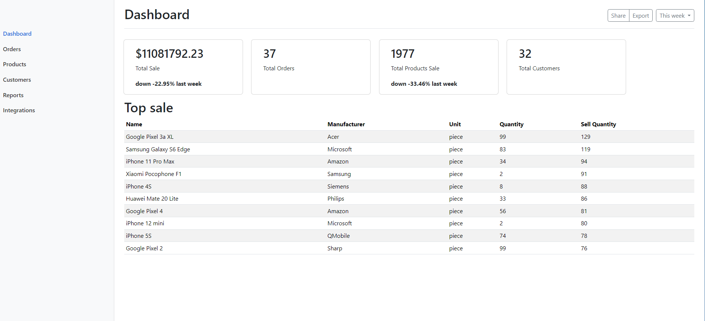
- Danh sách khách hàng
  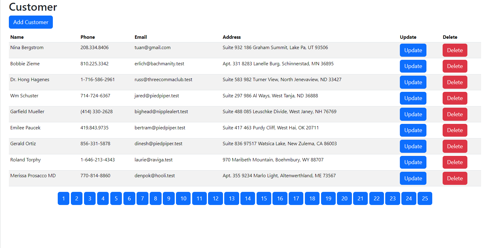
- Thêm khách hàng
  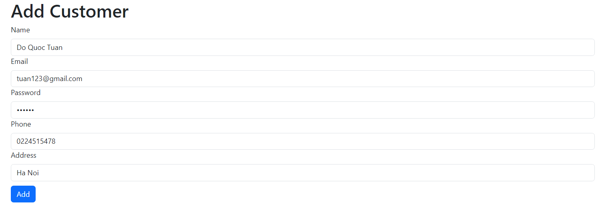
- Sau khi thêm
  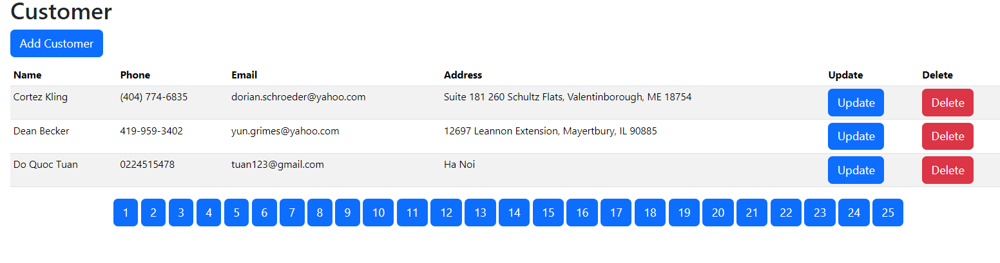
- Sửa khách hàng
  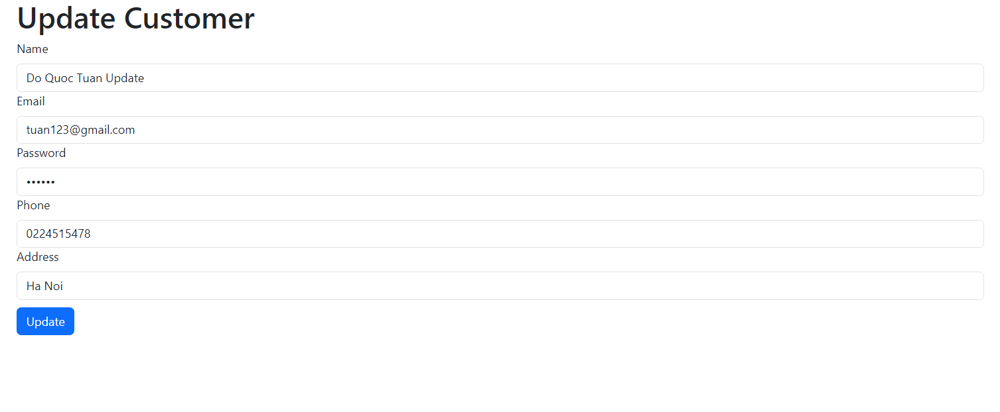
- Sau khi sửa
  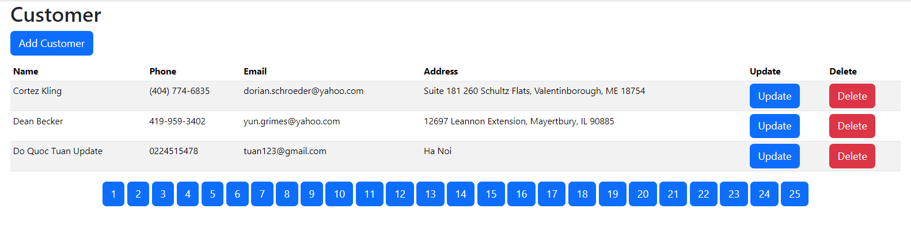
- Sau khi xóa
  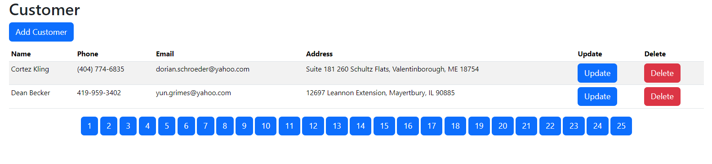
- Thông kê order theo 1 khoảng thời gian
  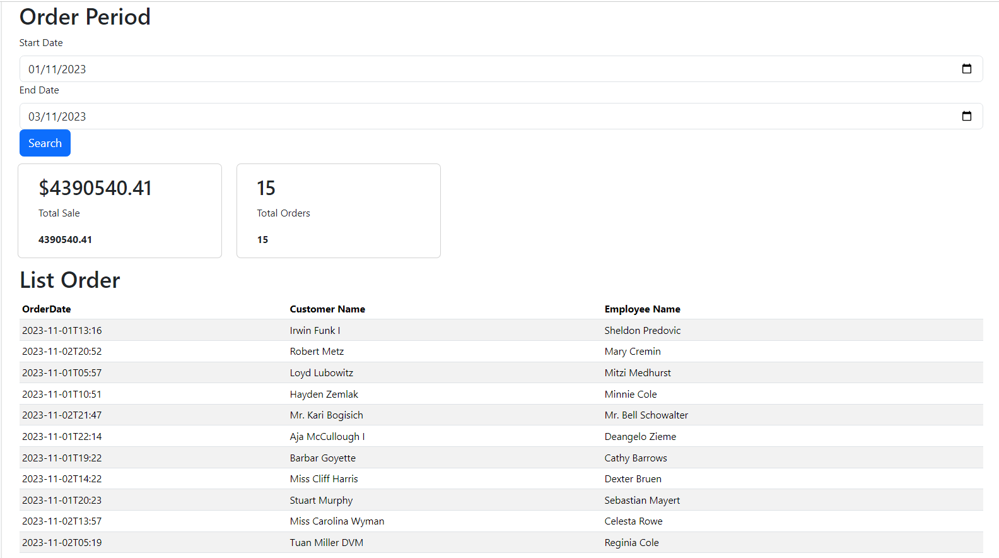
- Thêm sửa xóa các đối tượng khác tương tự ....
